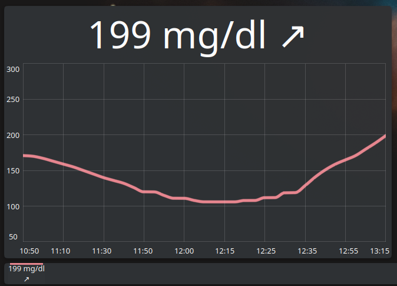

# Nightscout Widget for KDE

Plasma 6 widget made to read BG from Nightscout's [API](https://github.com/nightscout/cgm-remote-monitor).

The plasmoid supports both: a compact and a full mode.

* The compact representation is targeting panels and shows the last reading with optional units (configurable) and the trend arrow.
* The full representation shows a chart with readings of the last three hours in addition of the last reading and the trend arrow.

## Usage

* Download the `.plasmoid` from the [GitHub releases](https://github.com/woernsn/nightscout-widget-kde/releases) or from the [KDE store](https://www.pling.com/p/2302770/).
* Configure the widget when added.
* If using the compact representation, click it to extend it to the chart view.

## Configuration

Use the KDE widget configuration to configure:

* the NightScout server URL
* the NightScout token
* the update interval of the widget
* the units to be used (mg/dl or mmol/l)
* if the units should be shown in compact mode (useful for vertical panels)
* the minimum of the chart range (glucose level)
* the maximum of the chart range (glucose level)

> [!NOTE]  
> If a value in the chart is higher than the "Chart Maximum" value or lower than the "Chart Minimum" value, the chart will scale automatically and ignore the set values!
